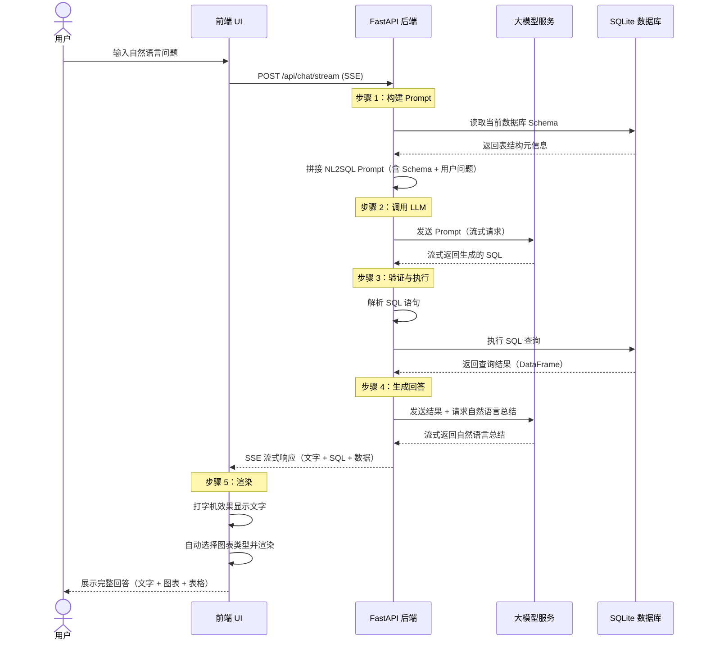
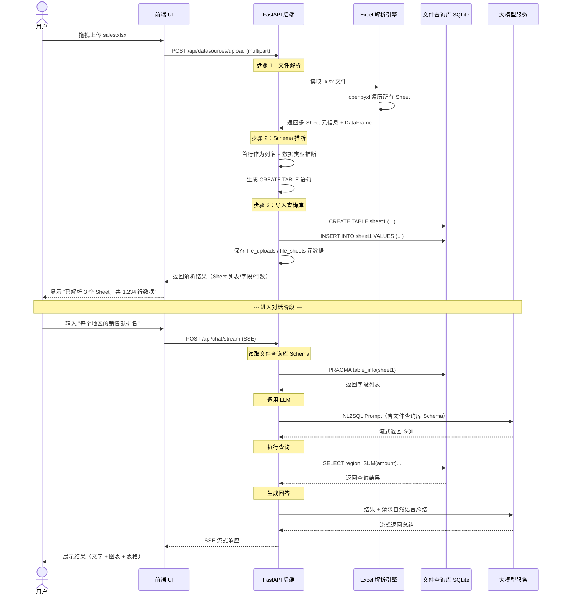
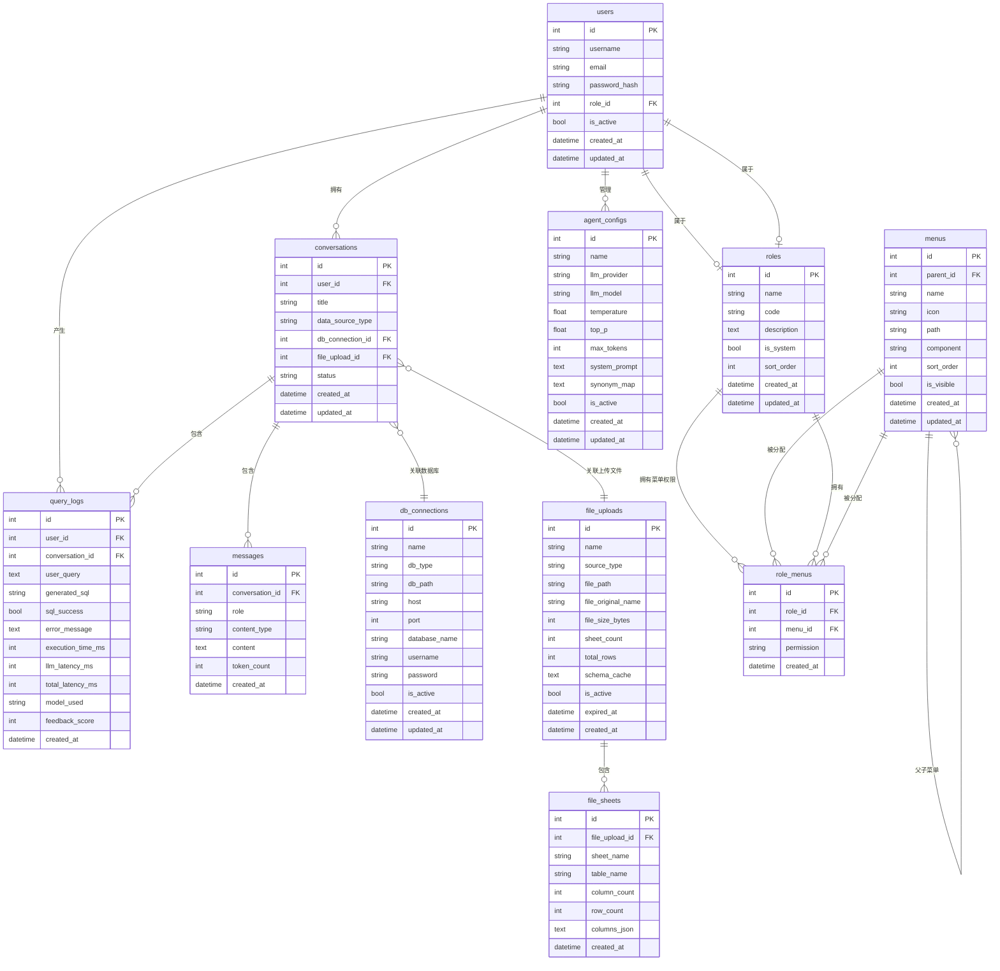
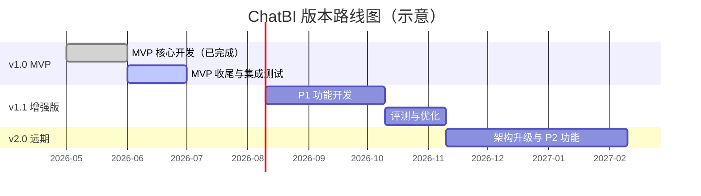

# ChatBI 产品需求文档 (PRD)

> **文档状态**：开发中（v1.0 MVP 基本完成）  
> **版本号**：v0.7  
> **最后更新**：2026-06-17  
> **作者**：许清楚（产品经理）  

---

## 目录

1. [产品概述](#1-产品概述)
2. [用户故事](#2-用户故事)
3. [需求池（按优先级）](#3-需求池按优先级)
4. [技术约束与选型建议](#4-技术约束与选型建议)
5. [核心交互流程](#5-核心交互流程)
6. [UI 设计指引](#6-ui-设计指引)
7. [数据模型（初步）](#7-数据模型初步)
8. [非功能需求](#8-非功能需求)
9. [待确认问题](#9-待确认问题)
10. [版本规划](#10-版本规划)

---

## 1. 产品概述

### 1.1 产品愿景与定位

> **一句话价值主张**：让不懂 SQL 的人也能用自然语言问数据，让懂 SQL 的人问得更快。

**ChatBI (Chat Business Intelligence)** 是一款基于大语言模型的对话式数据分析助手。用户使用自然语言提问，系统自动理解意图、生成 SQL、查询数据库、并以自然语言描述和可视化图表的形式返回分析结果。系统支持连接 **SQLite 数据库**和**上传 Excel/CSV 文件**两种数据源，上传文件后自动解析多 Sheet 表结构并以 SQL 方式查询取数。系统管理员可通过**数据智能体配置**管理后台，对 NL2SQL 智能体的大模型参数、系统提示词、语义同义词等进行灵活调优。

### 1.2 目标用户群体

| 用户角色 | 画像特征 | 核心诉求 |
|---------|---------|---------|
| **业务分析师** | 懂业务逻辑但 SQL 不熟练，常处理 Excel 报表 | 快速获取数据洞察，减少写 SQL 的时间 |
| **运营人员** | 日常需要看报表，技术能力一般 | 随时随地问数据，不用等 BI 团队排期 |
| **管理者** | 需要高频查看关键指标 | 用大白话问核心数据，快速决策 |
| **数据分析师** | SQL 熟练但想提升效率 | 把重复性查询交给 AI，聚焦深度分析 |
| **Excel/CSV 数据工作者** | 日常用 Excel 管理数据，不会数据库操作 | 上传 Excel 后直接用自然语言提问，无需导入数据库 |
| **开发者/管理员** | 负责系统配置和维护 | 管理数据源、配置数据智能体、监控使用情况、调优模型 |

### 1.3 核心解决痛点

| 痛点编号 | 痛点描述 | 解决方案 |
|---------|---------|---------|
| P01 | 业务人员写不出 SQL，依赖数分团队排期 | 自然语言直接查询，消除技术门槛 |
| P02 | 分析师大量时间花在重复性取数上 | AI 自动生成 SQL，人工审核后执行 |
| P03 | 多个数据源切换查询效率低 | 统一接入层，一个入口查所有数据源 |
| P04 | 查询结果只有表格，洞察不直观 | 自动匹配图表类型，可视化表达数据 |
| P05 | 业务语言与数据字段命名不一致 | NL2SQL 语义映射，支持自定义同义词库 |
| P06 | Excel/CSV 数据散落在本地文件，无法像数据库一样灵活查询 | 上传即查，自动解析表结构，用自然语言对 Excel 提问 |

### 1.4 设计原则

#### 模块化开发原则

整个系统按**高内聚、低耦合**的模块化架构设计，每个大功能模块具备清晰的边界、独立的接口和可替换性：

```
┌─────────────────────────────────────────────────────┐
│                    ChatBI 系统                        │
├─────────────────────────────────────────────────────┤
│  ┌───────────┐  ┌──────────────────────────────┐   │
│  │ 前端 UI   │  │        API 网关层             │   │
│  │ (React)   │◄─┤  (FastAPI 路由 + 中间件)       │   │
│  └─────┬─────┘  └──────────┬───────────────────┘   │
│        │                   │                        │
│        ▼                   ▼                        │
│  ┌─────────────────────────────────────────────┐   │
│  │              核心业务模块                     │   │
│  │  ┌──────────┐ ┌──────────┐ ┌──────────────┐│   │
│  │  │ 对话引擎  │ │ 数据源   │ │ 智能体       ││   │
│  │  │(Chat)    │ │(DataSource)│ │(AgentConfig) ││   │
│  │  └────┬─────┘ └────┬─────┘ └──────┬───────┘│   │
│  └───────┼────────────┼──────────────┼────────┘   │
│          │            │              │             │
│          ▼            ▼              ▼             │
│  ┌─────────────────────────────────────────────┐   │
│  │              基础服务模块                     │   │
│  │  ┌─────────┐ ┌─────────┐ ┌───────────────┐ │   │
│  │  │LLM 连接  │ │数据解析   │ │ SQL 引擎      │ │   │
│  │  │(Provider)│ │(Parser)  │ │ (Executor)   │ │   │
│  │  └─────────┘ └─────────┘ └───────────────┘ │   │
│  │  ┌─────────┐ ┌─────────┐ ┌───────────────┐ │   │
│  │  │Prompt   │ │SSE 流式  │ │ 安全校验      │ │   │
│  │  │(Builder)│ │(Streamer)│ │ (Validator)  │ │   │
│  │  └─────────┘ └─────────┘ └───────────────┘ │   │
│  └─────────────────────────────────────────────┘   │
└─────────────────────────────────────────────────────┘
```

**模块划分原则**：
1. **每个模块有唯一的职责和边界**，不跨模块耦合逻辑
2. **模块之间通过接口契约通信**（API / 事件 / 依赖注入），而非直接调用实现
3. **每个大功能模块可独立开发、测试、部署**
4. **模块支持替换实现**（如 LLM Provider 可从 DeepSeek 无缝切换到 Ollama）

#### 模块清单

| 模块名 | 层级 | 职责 | 对外接口 | 可替换性 |
|--------|------|------|---------|---------|
| **LLM Provider** | 基础服务 | 统一封装 LLM API 调用，支持多模型切换 | `BaseLLMProvider` 抽象接口 + 工厂模式 | ✅ 高（插拔式） |
| **Chat Engine** | 核心业务 | 编排 NL2SQL 四步管线（Schema→LLM→SQL→渲染） | `ChatSession` 对话会话接口 | 🟡 中（管线耦合） |
| **DataSource** | 核心业务 | 管理数据源（SQLite/Excel/CSV）的连接和 Schema | `BaseDataSource` 抽象接口 | ✅ 高（可扩展数据类型） |
| **Data Parser** | 基础服务 | 解析 Excel/CSV/其他文件格式为标准 DataFrame | `FileParser.parse()` | ✅ 高（可加新格式） |
| **SQL Executor** | 基础服务 | 安全校验 + 执行 SQL + 返回结果 | `SQLExecutor.execute()` | ✅ 高（可切换数据库） |
| **Prompt Builder** | 基础服务 | 管理 NL2SQL 提示词模板，支持版本化和配置 | `PromptBuilder.build()` | 🟡 中（模板内容可配） |
| **SSE Streamer** | 基础服务 | SSE 多事件流编排与管理 | `SSEStreamer.stream()` | 🟡 中 |
| **Auth & RBAC** | 核心业务 | 用户认证（JWT）+ 角色管理 + 菜单权限控制 | `AuthService.login/register()` + `RoleManager` + `MenuManager` | ✅ 高 |
| **Agent Config** | 核心业务 | 数据智能体参数配置（模型/Prompt/同义词） | `AgentConfig` CRUD 接口 | ✅ 高 |
| **Security Validator** | 基础服务 | SQL 语法校验 + 注入防护 + 输出过滤 | `SQLValidator.validate()` | ✅ 高 |

---

## 2. 用户故事

### 2.1 数据分析师场景

| 编号 | 角色 | 故事标题 | 用户故事 | 关联需求 |
|-----|------|---------|---------|---------|
| US-01 | 数据分析师 | 自然语言查询 | 作为一名数据分析师，我希望能够用自然语言描述我想要的查询，以便快速获取数据而不用手写 SQL。 | P0-单表查询、P0-聚合查询 |
| US-02 | 数据分析师 | 多表关联查询 | 作为一名数据分析师，我希望能够用自然语言描述跨表的关联查询，以便获取多维度综合分析结果。 | P0-多表 Join |
| US-03 | 数据分析师 | SQL 审核与修改 | 作为一名数据分析师，我希望看到 AI 生成的 SQL 并能够手动编辑修改，以便在 AI 生成结果不理想时进行调整。 | P0-对话 UI |
| US-04 | 数据分析师 | 跨 Sheet 关联分析 | 作为一名数据分析师，我希望上传的多 Sheet Excel 能被识别为多张表，并能跨 Sheet 做关联查询，以便综合多个 Sheet 的数据进行分析。 | P0-Excel 多 Sheet 解析、P0-多表 Join |
| US-05 | 数据分析师 | 历史查询回顾 | 作为一名数据分析师，我希望能够查看和管理我的历史查询记录，以便复用或修改之前的分析。 | P1-多轮对话上下文 |

### 2.2 业务人员场景

| 编号 | 角色 | 故事标题 | 用户故事 | 关联需求 |
|-----|------|---------|---------|---------|
| US-06 | 业务运营 | 即问即答数据 | 作为一名运营人员，我希望直接用大白话问我关心的业务数据（如"上周的日活趋势"），以便快速了解业务动态。 | P0-单表查询、P0-流式响应 |
| US-07 | 业务运营 | 图表可视化 | 作为一名运营人员，我希望查询结果能以图表（折线图、柱状图、饼图等）呈现，以便直观理解数据趋势。 | P0-基础图表展示 |
| US-08 | 业务运营 | 上传 Excel 即问即答 | 作为一名运营人员，我希望直接上传本地的 CSV/XLSX 文件，然后立即用自然语言对该文件提问，无需任何数据库配置。 | P0-Excel CSV 上传解析、P0-Excel 查询 |
| US-09 | 业务运营 | 追问与澄清 | 作为一名运营人员，我希望能够追问上一个问题（如"按城市拆开看看"），并且当问题模糊时系统能反问澄清。 | P1-多轮对话上下文、P1-反问澄清 |
| US-10 | 业务运营 | 导出报表 | 作为一名运营人员，我希望将查询结果导出为 Excel 或图片，以便在周报/月报中使用。 | P1-导出功能 |

### 2.3 管理者场景

| 编号 | 角色 | 故事标题 | 用户故事 | 关联需求 |
|-----|------|---------|---------|---------|
| US-11 | 部门管理者 | 快速看关键指标 | 作为一名部门经理，我希望能够一句话问出我关心的业务 KPI，以便快速掌握部门运营状况。 | P0-聚合查询、P0-对话 UI |
| US-12 | 部门管理者 | 对比分析 | 作为一名部门经理，我希望能够进行同比/环比等对比分析，以便判断业务变化趋势。 | P0-聚合查询、P1-智能图表推荐 |

### 2.4 系统管理员场景

| 编号 | 角色 | 故事标题 | 用户故事 | 关联需求 |
|-----|------|---------|---------|---------|
| US-13 | 系统管理员 | 数据源接入 | 作为一名系统管理员，我希望能够配置和管理 SQLite 数据库连接，或上传 Excel/CSV 文件作为数据源，以便系统能正确读取数据。 | P0-SQLite 数据源连接、P0-Excel CSV 上传解析 |
| US-14 | 系统管理员 | 使用监控 | 作为一名系统管理员，我希望看到一个管理后台，以便了解系统的使用情况和运行状态。 | P1-管理员后台 |
| US-15 | 系统管理员 | 数据智能体配置 | 作为一名系统管理员，我希望看到一个数据智能体的管理后台，以便管理数据智能体使用的大模型、模型相关参数（如温度等）、系统提示词、语义同义词等相关配置。 | P1-管理员后台 |
| US-16 | 系统管理员 | 用户管理 | 作为一名系统管理员，我希望能够管理用户账号（创建/编辑/禁用/删除），以便控制谁可以使用本系统。 | P0-用户管理 |
| US-17 | 系统管理员 | 角色管理 | 作为一名系统管理员，我希望能够创建和管理角色，并为每个角色分配不同的菜单权限，以便实现细粒度的访问控制。 | P0-角色管理、P0-菜单管理 |
| US-18 | 系统管理员 | 菜单导航管理 | 作为一名系统管理员，我希望能够动态配置系统的导航菜单项，控制不同角色能看到哪些菜单，以便按需定制工作台。 | P0-菜单管理 |

---

## 3. 需求池（按优先级）

### 3.1 P0 — 核心必做（MVP 范围）

> MVP 定义为：用户能够完成"提问 → 看数据"的完整闭环，且系统管理员可通过后台管理用户、角色与菜单权限。

| 编号 | 需求名称 | 描述 | 验收标准 |
|------|---------|------|---------|
| R-P0-01 | 单表查询 | 支持对单张表的自然语言查询，生成 SELECT/WHERE/GROUP BY/ORDER BY 等基础 SQL | 用户提问"显示 2025 年销售额 Top10 的商品"，系统返回正确结果 |
| R-P0-02 | 多表 Join | 支持对两张及以上表的关联查询，自动识别表间关系 | 用户提问"查询每个用户的订单数量和总金额"，系统能关联 users 和 orders 表 |
| R-P0-03 | 聚合查询 | 支持 SUM/AVG/COUNT/MIN/MAX 等聚合函数及 GROUP BY | 用户提问"按月统计注册用户数"，系统正确返回聚合结果 |
| R-P0-04 | 对话 UI | 提供类 ChatGPT 的对话界面，用户输入问题、系统返回回答 | 界面清晰，消息按时间倒序排列，支持 Markdown 渲染 |
| R-P0-05 | 流式响应 | LLM 文本和图表以流式（打字机效果）逐步展示 | 用户能实时看到文字逐字输出，图表在数据完成后渲染 |
| R-P0-06 | SQLite 数据源连接 | 支持连接本地 SQLite 数据库文件（.db/.sqlite） | 管理员能通过界面或配置文件指定 db 路径并成功连接 |
| R-P0-07 | Schema 同步 | 自动读取数据源的表结构（表名、列名、类型、主键、外键）并传递给 LLM | 系统能正确获取所有表元信息，并在 NL2SQL prompt 中使用 |
| R-P0-08 | 基础图表展示 | 根据查询结果自动选择合适的图表类型（折线图、柱状图、饼图、表格） | 时间序列数据默认折线图，分类对比默认柱状图，占比默认饼图 |
| R-P0-09 | Excel/CSV 上传解析 | 支持上传 .csv 和 .xlsx 文件（上限 20MB），自动解析并导入文件查询库；支持多 Sheet 识别，每个 Sheet 作为一张独立表，自动清洗表名/列名并记录原始名称映射 | 上传含 3 个 Sheet 的 Excel 后，系统正确识别出 3 张表及其字段名、数据类型、行数，并能在后续对话中复用该文件 |
| R-P0-10 | Excel 查询取数 | 对上传的 Excel/CSV 数据支持自然语言查询，生成标准 SQL 并执行取数 | 用户提问"Sheet1 中销售额最高的前 5 个商品"，系统返回正确结果 |
| R-P0-11 | 用户认证与登录 | 支持用户注册、登录、JWT Token 鉴权；API 接口需鉴权方可访问 | 用户可注册账号并登录系统，未登录无法访问任何页面 |
| R-P0-12 | 用户管理 | 管理员可查看用户列表、创建用户、编辑用户信息、禁用/启用用户、删除用户 | 管理员可在后台管理页面完成用户的增删改查和状态管理 |
| R-P0-13 | 角色管理 | 支持创建/编辑/删除角色；角色包含权限标识；一个角色可关联多个菜单 | 管理员可创建"分析师""查看者"等角色，并分配不同菜单权限 |
| R-P0-14 | 菜单管理 | 支持动态配置导航菜单项（名称/图标/路由/排序/父菜单）；菜单按角色渲染 | 管理员可新增菜单项、调整排序、配置对哪些角色可见 |

### 3.2 P1 — 增强功能（v1.1 范围）

| 编号 | 需求名称 | 描述 | 优先级 |
|------|---------|------|--------|
| R-P1-01 | 多轮对话上下文 | 支持用户追问，AI 能理解上下文语义（如"上个月呢？""按地区拆开"） | 高 |
| R-P1-02 | 反问澄清 | 当用户问题模糊时，AI 主动反问以明确需求（如"您是指订单量还是订单金额？"） | 高 |
| R-P1-03 | 智能图表推荐 | 根据数据特征自动推荐最优图表类型，支持图表配置调整 | 中 |
| R-P1-04 | 导出功能 | 支持查询结果导出为 CSV/Excel/PNG 格式 | 中 |
| R-P1-05 | SQL 解释 | 对生成的 SQL 添加自然语言注释，解释每条 SQL 的查询逻辑 | 中 |
| R-P1-06 | 数据智能体配置与管理后台 | 数据源管理、数据智能体配置（大模型选型/温度/系统提示词/语义同义词）、使用统计、日志查看 | 中 |
| R-P1-07 | 查询历史 | 保存历史对话和查询，支持搜索和回看 | 低 |

### 3.3 P2 — 远期规划（v2.0 范围）

| 编号 | 需求名称 | 描述 | 优先级 |
|------|---------|------|--------|
| R-P2-01 | 多模型切换 | 支持多种 LLM 后端（DeepSeek/Ollama/GPT-4 等），用户可自由切换 | 中 |
| R-P2-02 | 语音输入 | 支持语音转文字提问（Web Speech API） | 低 |
| R-P2-03 | 移动端适配 | 响应式设计或独立移动端，支持手机浏览器提问 | 低 |
| R-P2-04 | 协作空间 | 团队共享数据源、查询模板和报表看板 | 低 |
| R-P2-05 | 私有化部署 | 一键 Docker 部署包，支持内网环境离线使用 | 中 |
| R-P2-06 | NL2SQL 评测 | 内置 NL2SQL 评测数据集，定期评估模型准确率，生成评测报告 | 中 |

---

## 4. 技术约束与选型建议

### 4.1 技术栈推荐

| 层级 | 推荐方案 | 备选方案 | 说明 |
|------|---------|---------|------|
| **前端框架** | Vite + React 18+ | Vue 3 | React 生态更成熟，MUI + Tailwind 组合灵活 |
| **UI 组件库** | MUI (Material UI) + Tailwind CSS | Ant Design | MUI 组件丰富，Tailwind 做自定义样式 |
| **图表库** | ECharts | Recharts / Chart.js | ECharts 图表类型最全，无需双库并用，减少包体积 300KB+ |
| **SQL 校验** | sqlparse（AST 解析） | 正则表达式 | AST 级别校验更精确，有效拦截 DDL/DML |
| **后端框架** | FastAPI (Python 3.10+) | Flask / Node.js | FastAPI 异步支持好，与 Python AI 生态无缝对接 |
| **数据库** | SQLite 3 | 后续可升迁至 PostgreSQL | 零成本、文件级、MacBook Air 本地运行 |
| **Excel 解析** | pandas + openpyxl（xlsx）+ csv（标准库） | polars | pandas 生态成熟，openpyxl 支持多 Sheet 解析 |
| **LLM 接口** | 见下方 4.2 节 | — | 先免费方案，预留切换能力 |
| **ORM** | SQLAlchemy 2.0 + Alembic | — | 成熟稳定，支持 SQLite → PostgreSQL 无缝升迁 |

### 4.2 大模型选型方案

#### 方案一（推荐）：DeepSeek 免费 API

| 项目 | 说明 |
|------|------|
| **模型名称** | DeepSeek-V3 / DeepSeek-R1（推理模型） |
| **获取方式** | 官网申请 API Key：https://platform.deepseek.com/ |
| **费用** | 目前提供免费额度，后续按量计费（极低） |
| **优势** | NL2SQL 能力较强，中文理解好，响应速度快 |
| **适配** | OpenAI 兼容 API 格式，切换成本低 |

#### 方案二：Ollama 本地部署

| 项目 | 说明 |
|------|------|
| **模型名称** | Qwen2.5:7b / Qwen2.5-Coder:7b / Llama-3.1-8B |
| **部署方式** | Ollama 一键安装，本地运行 |
| **费用** | 免费，完全离线 |
| **优势** | 数据不出本地，隐私保护，无 API 调用成本 |
| **劣势** | NL2SQL 准确率低于云端模型，需要 MacBook Air 有足够内存 |

#### 方案三：混合方案（远期）

本地运行小模型做快速查询 + 云端大模型做复杂查询，可配置路由规则。

### 4.3 统一 LLM Provider 接口设计

为实现多模型无缝切换，MVP 阶段需定义以下抽象接口：

```python
from abc import ABC, abstractmethod
from typing import AsyncGenerator, Optional

class LLMResponse:
    """LLM 调用返回结果"""
    content: str
    model_name: str
    token_usage: dict  # {"prompt": 100, "completion": 50, "total": 150}

class BaseLLMProvider(ABC):
    """LLM Provider 抽象接口 — 所有模型接入层需实现此接口"""
    
    @abstractmethod
    async def chat(
        self,
        messages: list[dict],
        temperature: float = 0.1,
        max_tokens: int = 4096,
        stream: bool = False,
    ) -> AsyncGenerator[dict, None] | LLMResponse:
        """流式/非流式对话"""
        ...
    
    @abstractmethod
    async def health_check(self) -> bool:
        """健康检查"""
        ...

class LLMProviderFactory:
    """工厂模式 — 根据配置创建对应的 Provider 实例"""
    
    @staticmethod
    def create(provider_name: str, config: dict) -> BaseLLMProvider:
        if provider_name == "deepseek":
            return DeepSeekProvider(config)
        elif provider_name == "ollama":
            return OllamaProvider(config)
        elif provider_name == "openai":
            return OpenAIProvider(config)
        else:
            raise ValueError(f"Unknown provider: {provider_name}")
```

**关键设计要点**：
- 所有 Provider 实现同一抽象接口，上层代码无需感知具体模型
- 流式与非流式统一接口，通过 `stream` 参数区分
- 工厂模式 + 配置驱动，新增模型只需添加 Provider 实现类 + 注册工厂
- 内置健康检查接口，支持自动降级和 Fallback

### 4.4 API Key 管理方案

```python
# backend/config.py 示例
import os
from pydantic_settings import BaseSettings

class Settings(BaseSettings):
    # LLM 配置
    LLM_PROVIDER: str = "deepseek"        # deepseek | ollama
    DEEPSEEK_API_KEY: str = "YOUR_API_KEY_HERE"  # ← 占位符，用户自行填写
    DEEPSEEK_API_BASE: str = "https://api.deepseek.com/v1"
    DEEPSEEK_MODEL: str = "deepseek-chat"
    
    # Ollama 配置
    OLLAMA_BASE_URL: str = "http://localhost:11434"
    OLLAMA_MODEL: str = "qwen2.5:7b"
    
    # 数据库配置
    SQLITE_DB_PATH: str = "./data/chatbi.db"
    DATABASE_URL: str = f"sqlite:///{SQLITE_DB_PATH}"
    
    class Config:
        env_file = ".env"
        env_file_encoding = "utf-8"
```

> **使用方式**：在项目根目录创建 `.env` 文件，填写 `DEEPSEEK_API_KEY=sk-your-key-here`，直接替换占位符。`.env` 文件被 `.gitignore` 排除，确保 Key 不会提交到版本控制。

### 4.5 数据库升迁路径

```
SQLite（MVP）
    │
    ├─ 优势：零运维、文件级存储、无需安装服务
    ├─ 限制：不支持并发写、单机存储
    │
    ▼ 后期升迁
PostgreSQL
    │
    ├─ 优势：支持并发、支持 JSON/全文搜索/地理空间
    ├─ 迁移方式：SQLAlchemy + Alembic 自动迁移
    └─ 改动范围：仅修改 DATABASE_URL 配置项
```

### 4.6 Excel/CSV 数据导入方案

#### 核心架构

上传的 Excel/CSV 文件在 MVP 阶段采用 **文件查询库** 方案：原始文件保存到 `data/uploads/`，解析后的数据导入到 `data/file_dbs/{file_upload_id}.sqlite`。每个 Sheet 对应一张 SQLite 表，`file_uploads` 和 `file_sheets` 记录元数据、Schema、原始名称映射与查询库路径。这使得：

- **NL2SQL 管线无需修改**：LLM 仍然生成标准 SQLite SQL，执行引擎仍然走 SQLite
- **多 Sheet 支持自然**：`orders.xlsx` 中的 Sheet1/Sheet2/Sheet3 自动变为 `sheet1`/`sheet2`/`sheet3` 三张表
- **跨 Sheet Join 可行**：SQL 中通过表别名区分同名列；系统保留原始列名映射供 Prompt 展示
- **历史文件可复用**：用户从历史 Excel 文件列表中选择文件后，可直接创建或切换对话，无需重新上传
- **生命周期清晰**：删除上传文件时同步删除原始文件、查询库和 Sheet 元数据

> 说明：早期评审中提到的 `:memory:` 内存库不作为 MVP 默认方案。内存库适合一次性临时分析，但无法支撑“历史 Excel 单选复用”和“对话切换数据源”的产品交互。

#### 资源保护机制

| 限制项 | 上限值 | 超限处理 |
|--------|-------|---------|
| 单文件大小 | **20MB**（评审建议） | 拒绝上传并提示用户拆分 |
| 单文件 Sheet 数 | ≤ 50 个 | 超出截断并提示 |
| 单 Sheet 列数 | ≤ 200 列 | 超出截断并提示 |
| 总数据行数 | ≤ 100 万行 | 超出提示用户分批查询 |
| 解析内存占用上限 | 500MB | 解析前预估，超限拒绝加载 |
| 单次查询返回行数 | ≤ 10000 行 | SQL 执行层强制 LIMIT |
| 文件查询库磁盘占用 | 按文件记录 | 删除上传文件时级联清理 |

#### 处理流程

```
用户上传 Excel/CSV
    │
    ▼
[步骤 1] 文件接收与校验
    ├─ 校验文件格式（.csv / .xlsx）
    ├─ 校验文件大小（上限 20MB）
    └─ 校验编码（CSV 自动检测 UTF-8/GBK）
    │
    ▼
[步骤 2] 多 Sheet 解析
    ├─ .xlsx → openpyxl 读取所有 Sheet 名称和行列数据
    ├─ .csv → 单 Sheet，文件名作为表名
    └─ 每 Sheet 解析为 pandas DataFrame，解析后及时释放原始文件
    │
    ▼
[步骤 3] Schema 自动推断
    ├─ 首行作为列名（Column Header）→ 清理非法字符
    ├─ 列名自动加表名前缀（如 `sheet1_id`），防跨 Sheet Join 列名冲突
    ├─ 逐列推断数据类型（INTEGER / FLOAT / TEXT / DATE）
    └─ 生成 CREATE TABLE 语句
    │
    ▼
[步骤 4] 估算资源 + 导入文件查询库
    ├─ 预估内存占用（DataFrame 大小 × 2.5 安全系数）
    ├─ 超过 500MB → 拒绝加载并提示用户拆分文件
    ├─ 创建 `data/file_dbs/{file_upload_id}.sqlite`
    ├─ 逐表 CREATE TABLE + 批量 INSERT
    └─ 记录表名 → Sheet 名、清洗列名 → 原始列名的映射关系
    │
    ▼
[步骤 5] Schema 注入 NL2SQL
    └─ 将文件查询库的 Schema 按标准流程注入 LLM Prompt
```

#### 数据类型映射规则

| Excel 数据类型 | 推断为 SQLite 类型 | 示例 |
|--------------|-------------------|------|
| 纯数字（整数） | INTEGER | 100, -5, 0 |
| 纯数字（小数） | REAL (FLOAT) | 99.9, 3.14 |
| 文本/字符串 | TEXT | "北京", "2025-Q1" |
| 日期格式 | TEXT（ISO 格式） | 2025-01-15 → 统一为 TEXT |
| 布尔值 | INTEGER (0/1) | TRUE → 1, FALSE → 0 |
| 空值 | NULL | 允许 NULL |

---

## 5. 核心交互流程

### 5.1 数据源选择流程

```
用户进入系统
    │
    ├─ 已有 SQLite 数据源 → 选择该数据源 → 进入对话
    │
    └─ 没有数据源 / 想用 Excel
        │
        ▼
    上传 Excel/CSV 文件
        │
        ├─ 拖拽或点击上传 .csv / .xlsx
        ├─ 系统自动解析多 Sheet 结构和 Schema
        └─ 展示解析结果（表名/列名/行数）供用户确认
            │
            ▼
        进入对话（数据已导入文件查询库）
```

### 5.2 对话主流程描述

```
用户输入自然语言问题
    │
    ▼
[步骤 1] 意图识别与 Schema 注入
    ├─ 从当前数据源读取 Schema
    │   ├─ SQLite 数据源 → 从数据库读取表结构
    │   └─ Excel/CSV 数据源 → 从文件查询库读取已解析的 Schema
    ├─ 将表结构（含字段名、类型、注释）注入 LLM Prompt
    └─ 结合用户问题，构建完整 NL2SQL 请求
    │
    ▼
[步骤 2] LLM 生成 SQL
    ├─ LLM 返回生成的 SQL 语句
    ├─ SQL 语法校验（正则/语法解析器初步检查）
    └─ 可选：展示生成的 SQL 供用户审核（P1）
    │
    ▼
[步骤 3] SQL 执行
    ├─ 在目标数据源上执行 SQL
    │   ├─ SQLite 数据源 → 在原始数据库上执行
    │   └─ Excel/CSV 数据源 → 在文件查询库上执行
    ├─ 异常处理：SQL 执行错误则自动重试 / 提示 LLM 修正
    └─ 返回查询结果（DataFrame / 行列表）
    │
    ▼
[步骤 4] 结果渲染
    ├─ LLM 生成自然语言总结（流式输出）
    ├─ 前端根据数据特征选择图表类型
    └─ 图表 + 文字 + 原始数据表格同步展示
```

### 5.4 Mermaid 时序图（SQLite 数据源查询）



### 5.5 Mermaid 时序图（Excel/CSV 上传 + 查询）



### 5.3 对话与数据源生命周期

#### 核心约定

1. **创建对话时绑定数据源**：`POST /conversations` 时必须指定 `data_source_type` + 对应的 `db_connection_id` 或 `file_upload_id`
2. **切换数据源不丢失上下文**：通过 `PATCH /conversations/{id}` 更新对话绑定的数据源，当前对话上下文（消息历史）保留；切换后后续问题只查询新数据源
3. **单次对话只查询一个数据源**：`POST /chat/stream` 的消息始终基于对话当前绑定的数据源执行查询
4. **支持选定数据表**：创建对话或 PATCH 时可传入 `selected_tables`（数组），限制 NL2SQL 只查询指定的表；不传则由模型自行判断
5. **前端不得使用 `datasource_ids`**：所有接口统一使用 `data_source_type`、`db_connection_id`、`file_upload_id`、`selected_tables`，避免一组 ID 同时表达数据库和文件两种含义

#### 生命周期时序

```
创建对话: POST /conversations
  ├─ 必传: data_source_type + db_connection_id | file_upload_id
  ├─ 可选: selected_tables (["orders", "users"])  → 限制查询范围
  └─ 返回: conversation_id
  
对话中:
  ├─ 提问: POST /chat/stream { conversation_id, message }
  │        └─ 自动使用对话绑定的数据源 + 选定的表
  │
  └─ 换数据源: PATCH /conversations/{id}
       ├─ 传: { data_source_type: "db", db_connection_id: 2, selected_tables: [...] }
       ├─ 效果: 对话上下文保留，后续提问使用新数据源
       └─ 返回: 更新后的 conversation

切换数据源的 UI 交互：
  输入框左下角点击数据源名称 → 弹出 DataSourceSelector
    ├─ 选择新数据源 → 确认后前端调用 PATCH → 更新 chatStore
    └─ 用户继续提问，上下文不丢失
```

### 5.4 SSE（Server-Sent Events）消息协议

```json
// 后端→前端的 SSE 事件格式
event: token      // 普通文本 token（流式输出文字）
event: sql        // 生成的 SQL 语句
event: chart      // 图表数据（JSON 格式 {type, data, config}）
event: table      // 原始数据表格
event: error      // 错误信息
event: done       // 回答结束标志
```

---

## 6. UI 设计指引

### 6.1 页面结构

```
┌─────────────────────────────────────────────┐
│                   导航栏（动态渲染，按角色展示）    │
│  [ChatBI Logo]  [新对话]  [数据源]  [智能体]     │
│  [系统管理 ▼]          ← 仅 admin 角色可见       │
│    ├─ 用户管理                                   │
│    ├─ 角色管理                                   │
│    ├─ 菜单管理                                   │
│    └─ 系统设置                                   │
│  [设置]                                         │
├──────────────────┬──────────────────────────┤
│                  │                          │
│   对话历史列表    │     主对话区域            │
│                  │                          │
│  对话 1 (当前)   │  ┌────────────────────┐  │
│  对话 2          │  │ 用户消息气泡        │  │
│  对话 3          │  ├────────────────────┤  │
│  对话 4          │  │ AI 回答流式展示     │  │
│                  │  │  ├─ 文字总结        │  │
│                  │  │  ├─ SQL 代码块      │  │
│                  │  │  └─ 图表 + 表格     │  │
│                  │  ├────────────────────┤  │
│                  │  │ ... 更多消息 ...    │  │
│                  │  │                    │  │
│                  │  └────────────────────┘  │
│                  │                          │
│                  │  ┌────────────────────┐  │
│                  │  │ 输入框区域           │  │
│                  │  │ ┌────────────────┐  │  │
│                  │  │ │ ✏️ 输入问题...   │  │  │
│                  │  │ └────────────────┘  │  │
│                  │  │ 📂 sales.db (3张表) 🤖 DeepSeek  │  │
│                  │  └───┬────────────────┘  │
│                  │      │ 点击弹出           │
│                  │      ▼                   │
│                  │  ┌────────────────────┐  │
│                  │  │ 数据源选择面板       │  │
│                  │  │                    │  │
│                  │  │ ┌──────┬─────────┐ │  │
│                  │  │ │数据库│  Excel   │ │  │  ← Tab 切换
│                  │  │ ├──────┴─────────┤ │  │
│                  │  │ │ ○ sales.db     │ │  │
│                  │  │ │   ☑ orders     │ │  │  ← 展开显示表列表，支持多选
│                  │  │ │   ☑ users      │ │  │
│                  │  │ │   ☐ products   │ │  │
│                  │  │ │ ○ hr_data.db   │ │  │
│                  │  │ │   ☑ employees  │ │  │
│                  │  │ │ ○ 让模型自行判断│ │  │  ← 勾选此项则模型自主选表
│                  │  │ └───────────────┘ │  │
│                  │  └────────────────────┘  │
├──────────────────┴──────────────────────────┤
└─────────────────────────────────────────────┘
```

### 6.2 页面清单

| 页面 | 路由 | 核心功能 | 优先级 |
|------|------|---------|--------|
| 对话页 | `/` 或 `/chat` | 用户提问、AI 回答、图表展示、输入框底部数据源/模型快捷切换 | P0 |
| 数据源管理页 | `/datasources` | 数据库连接配置 + Excel/CSV 上传解析 + Schema 预览 + 历史 Excel 文件管理 | P0 |
| 用户管理页 | `/admin/users` | 用户列表、创建用户、编辑用户、禁用/启用、删除 | P0 |
| 角色管理页 | `/admin/roles` | 角色列表、创建角色、编辑角色（含菜单权限分配） | P0 |
| 菜单管理页 | `/admin/menus` | 菜单树管理、新增/编辑/排序菜单项、配置可见角色 | P0 |
| 数据智能体配置页 | `/agents` | 智能体大模型选型、温度参数、系统提示词编辑、语义同义词管理 | P1 |
| 设置页 | `/settings` | API Key、主题切换 | P1 |
| 管理后台 | `/admin` | 使用统计、对话日志、模型评测 | P1 |
| 查询历史页 | `/history` | 历史对话搜索和回看 | P1 |

### 6.3 核心组件说明

| 组件名称 | 功能描述 | 关键设计要点 |
|---------|---------|-------------|
| **MessageList** | 消息列表容器，展示对话历史 | 虚拟滚动（长对话性能优化）；消息按时间正序排列 |
| **MessageBubble** | 单条消息气泡（用户或 AI） | 用户消息右对齐；AI 消息左对齐 + Avatar |
| **MarkdownRenderer** | 渲染 AI 回答中的 Markdown 内容 | 支持代码高亮、表格渲染、数学公式（可选） |
| **SQLBlock** | 展示 SQL 代码段 | 语法高亮、一键复制按钮、可选的手动编辑模式（P1） |
| **ChartContainer** | 图表展示容器 | 自适应宽度，支持切换图表类型，支持下载（P1） |
| **DataTable** | 原始数据表格 | 支持分页、排序、列宽拖拽、导出（P1） |
| **InputBar** | 输入框区域，底部集成数据源与模型选择器 | 多行输入（Shift+Enter 换行，Enter 发送）；加载中禁用；左下角固定显示当前数据源名称 + 模型名称，点击数据源名称弹出 DataSourceSelector 面板 |
| **DataSourceSelector** | 数据源选择弹出面板（点击输入框左下角数据源名称触发） | 双 Tab 设计：<br>**「数据库」Tab**：列出已配置的数据库连接 → 展开显示该库下所有数据表（带 ☑ 多选）→ 提供"让模型自行判断"选项（勾选后将表列表全部注入 Prompt 由 LLM 决策）<br>**「Excel」Tab**：上半部分显示"上传新文件"按钮（跳转文件选择器）→ 下半部分列出历史上传的 Excel 文件列表（单选，点击即选中）|
| **TypingEffect** | 流式文字渲染（打字机效果） | 逐字展示，支持 Markdown 分段流式渲染 |
| **FileUploader** | Excel/CSV 文件上传区域 | 支持拖拽 + 点击两种上传方式；文件类型限制 .csv/.xlsx；上传进度条（含百分比）；上传完成后自动显示解析结果摘要（Sheet 列表/字段/行数） |
| **SchemaPreview** | 数据源 Schema 预览面板 | 以树形/表格形式展示表结构（表名 → 字段名 → 类型 → 示例值），支持展开/折叠 Sheet 详情 |
| **AgentConfigPanel** | 数据智能体配置面板 | 大模型参数（温度/Top-P）滑块调节、系统提示词富文本编辑器、语义同义词表格增删改 |
| **UserManager** | 用户管理列表页 | 表格展示用户列表（用户名/邮箱/角色/状态/创建时间）；行操作：编辑/禁用/删除；顶部按钮：新建用户 |
| **RoleManager** | 角色管理列表页 | 表格展示角色列表（名称/描述/关联用户数）；编辑角色时可分配菜单权限（树形勾选框） |
| **MenuManager** | 菜单管理列表页 | 树形结构展示菜单层级；拖拽排序；编辑菜单可配置名称/图标/路由/父菜单/可见角色（多选） |

### 6.4 交互模式

| 模式 | 描述 | 实现要点 |
|------|------|---------|
| **打字机效果** | AI 文字逐字流式输出，模拟人打字 | 利用 SSE 流式接收 token，逐步追加到 DOM |
| **图表渐进渲染** | 图表数据准备好后自动渲染 | 先显示骨架屏，数据到齐后使用动画过渡 |
| **用户消息发送中** | 发送后立即显示用户消息，处于 loading 状态 | 用骨架屏/脉冲动画表示 AI 正在思考 |
| **自适应图表** | 图表容器宽度随窗口变化自动适配 | ECharts `resize` 监听，配合 ResizeObserver |
| **错误恢复** | 当 NL2SQL 失败时，友好提示并提供操作建议 | 显示错误原因 + "重新提问" 按钮 |
| **智能体配置即时生效** | 修改智能体参数（温度/Prompt/同义词）后无需重启服务 | 后端热加载配置，下次对话自动采用新参数 |
| **Excel 上传即用** | 上传完成后自动进入对话模式，无需额外配置 | 上传 → 解析 → Schema 展示 → 自动创建对话 → 用户可立即提问 |
| **数据源/模型快捷切换** | 输入框左下角常驻数据源和模型选择器，无需跳转设置页 | 点击数据源名称弹出 DataSourceSelector 面板（双 Tab：数据库多选 / Excel 单选）；点击模型名称弹出模型切换下拉列表；切换后对话上下文不丢失 |
| **数据库表多选** | 选择数据库后可进一步勾选具体的数据表 | 表名带 ☑ 复选框，支持全选/反选；也可勾选"让模型自行判断"跳过手动选择 |
| **Excel 单选历史** | Excel 数据源仅支持单选 | Tab 切换到 Excel 后，历史文件列表为单选框（radio）；上传新文件后自动选中该文件 |
| **JWT 鉴权** | 全部 API 接口需携带 JWT Token 访问 | 登录后返回 Token，前端存储在 localStorage/HttpOnly Cookie，每次请求在 Header 中携带 |
| **基于角色的导航渲染** | 导航栏菜单按当前用户角色动态渲染 | 后端返回菜单列表时根据用户角色过滤，前端按树形结构渲染 |

### 6.5 视觉风格指引

| 项目 | 要求 | 参考 |
|------|------|------|
| **配色** | 柔和、中性背景，蓝色为主色调 | LIGHT: #f5f7fa 背景 / DARK: #1a1a2e 背景 |
| **字体** | 系统默认字体（-apple-system, BlinkMacSystemFont） | 无衬线字体，阅读友好 |
| **圆角** | 统一圆角 8px（卡片、按钮、输入框） | Material Design 风格 |
| **阴影** | 轻微阴影（`box-shadow: 0 1px 3px rgba(0,0,0,0.1)`） | 卡片层次感 |
| **暗色模式** | P1 功能，支持主题切换 | 使用 MUI ThemeProvider |

---

## 7. 数据模型（初步）

### 7.1 数据库表结构

#### 7.1.1 users（用户表）

| 列名 | 类型 | 约束 | 说明 |
|------|------|------|------|
| id | INTEGER | PK, AUTOINCREMENT | 用户ID |
| username | VARCHAR(64) | UNIQUE, NOT NULL | 用户名 |
| email | VARCHAR(128) | UNIQUE | 邮箱 |
| password_hash | VARCHAR(256) | NOT NULL | 密码哈希 |
| role_id | INTEGER | FK → roles.id, NOT NULL | 所属角色 |
| is_active | BOOLEAN | DEFAULT TRUE | 是否活跃 |
| created_at | DATETIME | DEFAULT CURRENT_TIMESTAMP | 创建时间 |
| updated_at | DATETIME | DEFAULT CURRENT_TIMESTAMP | 更新时间 |

#### 7.1.2 conversations（对话表）

| 列名 | 类型 | 约束 | 说明 |
|------|------|------|------|
| id | INTEGER | PK, AUTOINCREMENT | 对话ID |
| user_id | INTEGER | FK → users.id, NOT NULL | 用户ID |
| title | VARCHAR(256) | | 对话标题（自动摘要生成） |
| data_source_type | VARCHAR(20) | DEFAULT 'db' | 数据源类型（db / excel / csv） |
| db_connection_id | INTEGER | FK → db_connections.id | 引用的数据库连接（data_source_type=db 时使用） |
| file_upload_id | INTEGER | FK → file_uploads.id | 引用的上传文件（data_source_type=excel/csv 时使用） |
| status | VARCHAR(20) | DEFAULT 'active' | 状态（active/archived） |
| created_at | DATETIME | DEFAULT CURRENT_TIMESTAMP | 创建时间 |
| updated_at | DATETIME | DEFAULT CURRENT_TIMESTAMP | 最后更新时间 |

#### 7.1.3 messages（消息表）

| 列名 | 类型 | 约束 | 说明 |
|------|------|------|------|
| id | INTEGER | PK, AUTOINCREMENT | 消息ID |
| conversation_id | INTEGER | FK → conversations.id, NOT NULL | 所属对话ID |
| role | VARCHAR(20) | NOT NULL | 角色（user/assistant/system） |
| content_type | VARCHAR(20) | DEFAULT 'mixed' | 内容类型（text / sql / chart / table / mixed），便于过滤查询 |
| content | TEXT | NOT NULL | 消息内容（JSON 格式，含文字/SQL/图表数据） |
| token_count | INTEGER | | 消息的 token 数量（用于成本统计） |
| created_at | DATETIME | DEFAULT CURRENT_TIMESTAMP | 创建时间 |

> `content` 字段存储 JSON 格式示例：
> ```json
> {
>   "text": "2025年销售额Top10的商品如下：",
>   "sql": "SELECT product_name, SUM(amount) as total FROM orders WHERE year = 2025 GROUP BY product_name ORDER BY total DESC LIMIT 10",
>   "chart": { "type": "bar", "data": [...] },
>   "table": { "columns": ["商品名", "销售额"], "rows": [...] }
> }
> ```

#### 7.1.4 db_connections（数据库连接配置表）

| 列名 | 类型 | 约束 | 说明 |
|------|------|------|------|
| id | INTEGER | PK, AUTOINCREMENT | 连接ID |
| name | VARCHAR(128) | NOT NULL | 连接名称（如"生产数据库"、"测试库"） |
| db_type | VARCHAR(20) | NOT NULL, DEFAULT 'sqlite' | 数据库类型（sqlite / postgresql / mysql） |
| db_path | VARCHAR(512) | | SQLite 文件路径（仅 sqlite 类型使用） |
| host | VARCHAR(128) | | 数据库主机 |
| port | INTEGER | | 数据库端口 |
| database_name | VARCHAR(128) | | 数据库名称 |
| username | VARCHAR(128) | | 数据库用户名 |
| password | VARCHAR(256) | | 数据库密码（需加密/引用环境变量） |
| is_active | BOOLEAN | DEFAULT TRUE | 是否启用 |
| created_at | DATETIME | DEFAULT CURRENT_TIMESTAMP | 创建时间 |
| updated_at | DATETIME | DEFAULT CURRENT_TIMESTAMP | 更新时间 |

#### 7.1.5 file_uploads（上传文件数据源表）

| 列名 | 类型 | 约束 | 说明 |
|------|------|------|------|
| id | INTEGER | PK, AUTOINCREMENT | 文件ID |
| name | VARCHAR(128) | NOT NULL | 数据源名称（如"2025销售报表.xlsx"） |
| source_type | VARCHAR(20) | NOT NULL, DEFAULT 'excel' | 文件类型（excel / csv） |
| file_path | VARCHAR(512) | | 文件存储路径 |
| query_db_path | VARCHAR(512) | NOT NULL | 解析后生成的文件查询库路径（如 `data/file_dbs/3.sqlite`） |
| file_original_name | VARCHAR(256) | NOT NULL | 上传时的原始文件名 |
| file_size_bytes | INTEGER | | 文件大小（字节） |
| sheet_count | INTEGER | | Sheet 数量 |
| total_rows | INTEGER | | 总数据行数 |
| schema_cache | TEXT | | Schema 缓存（JSON 格式，含每张表的字段列表和类型） |
| is_active | BOOLEAN | DEFAULT TRUE | 是否启用 |
| expired_at | DATETIME | | 过期时间（到期自动清理，MVP 默认 7 天） |
| created_at | DATETIME | DEFAULT CURRENT_TIMESTAMP | 创建时间 |

#### 7.1.6 agent_configs（数据智能体配置表 — P1 后添加）

| 列名 | 类型 | 约束 | 说明 |
|------|------|------|------|
| id | INTEGER | PK, AUTOINCREMENT | 配置ID |
| name | VARCHAR(128) | NOT NULL | 智能体名称（如"默认NL2SQL智能体"） |
| llm_provider | VARCHAR(64) | NOT NULL, DEFAULT 'deepseek' | 大模型提供商（deepseek/ollama/openai） |
| llm_model | VARCHAR(128) | NOT NULL | 模型名称（如 deepseek-chat / qwen2.5:7b） |
| temperature | FLOAT | DEFAULT 0.1 | 模型温度参数（0.0-2.0，NL2SQL 建议低温度） |
| top_p | FLOAT | DEFAULT 0.9 | Top-P 采样参数 |
| max_tokens | INTEGER | DEFAULT 4096 | 最大输出 Token 数 |
| system_prompt | TEXT | | 系统提示词（用户可自定义编辑） |
| synonym_map | TEXT | | 语义同义词映射表（JSON 格式，如 {"销售额": "amount", "用户数": "user_count"}） |
| is_active | BOOLEAN | DEFAULT TRUE | 是否启用 |
| created_at | DATETIME | DEFAULT CURRENT_TIMESTAMP | 创建时间 |
| updated_at | DATETIME | DEFAULT CURRENT_TIMESTAMP | 更新时间 |

> `synonym_map` 字段存储 JSON 格式示例：
> ```json
> {
>   "销售额": "amount",
>   "用户数": "user_count",
>   "下单": "order_count",
>   "月活跃": "monthly_active_users"
> }
> ```

#### 7.1.7 file_sheets（上传文件 Sheet 信息表 — 用于 Excel/CSV）

| 列名 | 类型 | 约束 | 说明 |
|------|------|------|------|
| id | INTEGER | PK, AUTOINCREMENT | 记录ID |
| file_upload_id | INTEGER | FK → file_uploads.id, NOT NULL | 关联的上传文件ID |
| sheet_name | VARCHAR(256) | NOT NULL | Sheet 名称（如"Sheet1"、"销售数据"） |
| table_name | VARCHAR(256) | NOT NULL | 文件查询库中对应的表名（如"tbl_sheet1"、"tbl_sales"） |
| column_count | INTEGER | | 字段数量 |
| row_count | INTEGER | | 数据行数 |
| columns_json | TEXT | | 字段列表 JSON（[{"name":"col1","type":"TEXT"},...]） |
| name_mapping_json | TEXT | | 原始 Sheet/列名与清洗后表名/列名的映射 |
| created_at | DATETIME | DEFAULT CURRENT_TIMESTAMP | 创建时间 |

> 示例数据：
> ```json
> {
>   "file_upload_id": 2,
>   "sheets": [
>     {"sheet_name": "订单数据", "table_name": "订单数据", "column_count": 8, "row_count": 500},
>     {"sheet_name": "用户信息", "table_name": "用户信息", "column_count": 5, "row_count": 200}
>   ]
> }
> ```

#### 7.1.8 roles（角色表）

| 列名 | 类型 | 约束 | 说明 |
|------|------|------|------|
| id | INTEGER | PK, AUTOINCREMENT | 角色ID |
| name | VARCHAR(64) | UNIQUE, NOT NULL | 角色名称（如"管理员"、"分析师"、"查看者"） |
| code | VARCHAR(64) | UNIQUE, NOT NULL | 角色编码（如 admin / analyst / viewer），用于代码中鉴权 |
| description | TEXT | | 角色描述 |
| is_system | BOOLEAN | DEFAULT FALSE | 系统内置角色（不可删除） |
| sort_order | INTEGER | DEFAULT 0 | 排序序号 |
| created_at | DATETIME | DEFAULT CURRENT_TIMESTAMP | 创建时间 |
| updated_at | DATETIME | DEFAULT CURRENT_TIMESTAMP | 更新时间 |

> 预设角色：
> | 角色名称 | 角色编码 | 说明 |
> |---------|---------|------|
> | 超级管理员 | admin | 拥有全部权限，不可删除 |
> | 数据分析师 | analyst | 可使用对话分析、管理数据源、配置智能体 |
> | 普通用户 | user | 仅可使用对话分析和查看结果 |

#### 7.1.9 menus（菜单表）

| 列名 | 类型 | 约束 | 说明 |
|------|------|------|------|
| id | INTEGER | PK, AUTOINCREMENT | 菜单ID |
| parent_id | INTEGER | FK → menus.id, DEFAULT NULL | 父菜单ID（NULL 为顶级菜单） |
| name | VARCHAR(64) | NOT NULL | 菜单显示名称（如"对话分析"、"用户管理"） |
| icon | VARCHAR(64) | | 图标名称（如 ChatIcon、PeopleIcon） |
| path | VARCHAR(256) | | 前端路由路径（如 /chat、/admin/users） |
| component | VARCHAR(128) | | Vue/React 组件路径 |
| sort_order | INTEGER | DEFAULT 0 | 排序序号 |
| is_visible | BOOLEAN | DEFAULT TRUE | 是否可见 |
| created_at | DATETIME | DEFAULT CURRENT_TIMESTAMP | 创建时间 |
| updated_at | DATETIME | DEFAULT CURRENT_TIMESTAMP | 更新时间 |

#### 7.1.10 role_menus（角色菜单关联表）

| 列名 | 类型 | 约束 | 说明 |
|------|------|------|------|
| id | INTEGER | PK, AUTOINCREMENT | 关联ID |
| role_id | INTEGER | FK → roles.id, NOT NULL | 角色ID |
| menu_id | INTEGER | FK → menus.id, NOT NULL | 菜单ID |
| permission | VARCHAR(20) | DEFAULT 'read' | 权限级别（read / write / admin） |
| created_at | DATETIME | DEFAULT CURRENT_TIMESTAMP | 创建时间 |

> UNIQUE 约束：`(role_id, menu_id)` 唯一组合

#### 7.1.11 query_logs（查询日志表 — P1 后添加）

| 列名 | 类型 | 约束 | 说明 |
|------|------|------|------|
| id | INTEGER | PK, AUTOINCREMENT | 日志ID |
| user_id | INTEGER | FK → users.id | 用户ID |
| conversation_id | INTEGER | FK → conversations.id | 对话ID |
| user_query | TEXT | NOT NULL | 用户原始问题 |
| generated_sql | TEXT | | 生成的 SQL 语句 |
| sql_success | BOOLEAN | | SQL 执行是否成功 |
| error_message | TEXT | | 错误详情（SQL 语法错误 / 执行超时等） |
| execution_time_ms | INTEGER | | SQL 执行耗时（毫秒） |
| llm_latency_ms | INTEGER | | LLM 调用耗时（毫秒） |
| total_latency_ms | INTEGER | | 端到端耗时（毫秒） |
| model_used | VARCHAR(64) | | 使用的模型名称 |
| feedback_score | INTEGER | | 用户反馈评分（1-5） |
| created_at | DATETIME | DEFAULT CURRENT_TIMESTAMP | 创建时间 |

### 7.2 ER 图



---

## 8. 非功能需求

### 8.1 性能

| 指标 | 目标值 | 测量方式 | 说明 |
|------|-------|---------|------|
| **LLM 首 token 延迟** | < 3 秒 | SSE 首包耗时 | 受网络/本地模型推理速度影响 |
| **SQL 执行耗时** | < 2 秒（百万级数据） | 后端计时 | SQLite 对百万级数据查询性能尚可 |
| **Excel 文件解析速度** | 10MB 文件 < 5 秒 | 后端计时 | 含多 Sheet 解析 + Schema 推断 + 入库 |
| **Excel 文件大小上限** | MVP 建议 ≤ 20MB | 后端校验 | 超限提示用户拆分；50MB 文件解析后内存占用可达 1GB |
| **单文件最大 Sheet 数** | ≤ 50 个 Sheet | 后端校验 | 超出提示拆分 |
| **单 Sheet 最大列数** | ≤ 200 列 | 后端校验 | 超出截断或提示 |
| **端到端响应时间** | < 8 秒 | 前端计时 | 用户从发送到看到完整回答的感知时间 |
| **页面加载时间** | < 2 秒 | Lighthouse | 首屏加载，代码分割 + 懒加载 |
| **并发用户数** | MVP 暂不要求 | — | 本地 SQLite 不支持高并发写 |

### 8.2 安全

| 安全类型 | 风险描述 | 防护措施 |
|---------|---------|---------|
| **SQL 注入** | 用户通过恶意提问构造危险 SQL | 1. LLM 作为第一道防线（不直接拼接用户输入）<br>2. **sqlparse AST 解析校验**：解析 SQL 语法树，校验根节点为 SELECT，禁止 DDL/DML（替代正则方案）<br>3. SQL 执行仅使用只读事务（SELECT ONLY）<br>4. SQLite 连接使用 `PRAGMA query_only = ON` 或 `uri?mode=ro`（数据库级别防护）<br>5. 强制追加 `LIMIT 10000` 防全表扫描 |
| **Prompt 注入** | 用户通过提问诱导 LLM 输出越狱内容 | 1. 系统 Prompt 设置严格的角色边界<br>2. 用户输入进行敏感词过滤<br>3. 限制 LLM 输出格式为结构化 JSON |
| **API Key 泄露** | API Key 硬编码或被提交到代码仓库 | 1. 使用 `.env` 环境变量 + `.gitignore` 排除<br>2. 建议 Key 仅保存在本地，不上传到任何服务<br>3. 后端读取环境变量，前端永远不接触 Key |
| **用户认证** | 未登录用户访问受保护 API | 1. JWT Token 鉴权，所有 API 需 Bearer Token<br>2. 登录接口返回 Token，设置合理过期时间（建议 24h）<br>3. 刷新 Token 机制<br>4. 密码使用 bcrypt/argon2 哈希存储 |
| **数据安全** | 数据库文件被未授权访问 | 1. SQLite 文件存放在非公开目录<br>2. 后端接口需身份认证（MVP 阶段至少增加简单 Token 鉴权）<br>3. 敏感字段加密存储 |
| **文件上传安全** | 上传恶意文件或超大文件 | 1. 严格校验文件扩展名（仅 .csv/.xlsx）<br>2. 服务端 MIME 类型二次校验<br>3. 文件大小限制 + 解析超时保护<br>4. 原始文件和文件查询库仅存放在后端非公开目录<br>5. 删除文件时级联清理原始文件、查询库和元数据 |

### 8.3 可扩展性

| 维度 | 设计要点 | 实现方式 |
|------|---------|---------|
| **多模型切换** | 支持多种 LLM 后端 | 定义统一的 `BaseLLMProvider` 抽象接口 + `LLMProviderFactory` 工厂模式，不同模型实现同一接口，通过配置切换 |
| **智能体配置热加载** | 温度/Prompt/同义词修改后即时生效 | 配置存储于数据库 `agent_configs` 表，对话时实时读取，无需重启服务 |
| **语义同义词扩展** | 用户可自定义业务术语与数据字段的映射关系 | `agent_configs.synonym_map` 存储 JSON 映射，查询时注入 Prompt |
| **模块化架构** | 大功能模块独立开发、测试、部署 | 每个模块通过接口契约通信（详见 1.4 模块化设计原则），核心模块：LLM Provider / Chat Engine / DataSource / SQL Executor / Prompt Builder |
| **工作流→Agent 演进** | 当前为确定性的工作流管线；远期可升级为 ReAct Agent | 预留 Tool/Function Calling 接口：MVP 阶段将 SQL_EXECUTOR 和 DATA_SOURCE 定义为 Tool 签名，后续 Agent 可直接调用这些 Tool，无需重写管线 |
| **数据库升迁** | SQLite → PostgreSQL | SQLAlchemy 统一 ORM 层，更换 DATABASE_URL 和驱动即可 |
| **多数据源** | 支持同时配置多个数据源 | `db_connections` 管理数据库连接，`file_uploads` 管理文件数据源；每个对话绑定一个数据源 |
| **多 Sheet Excel** | 一个 Excel 文件包含多个 Sheet | `file_sheets` 表记录 Sheet 元信息，每个 Sheet 作为文件查询库中的独立表 |
| **图表扩展** | 新增图表类型无需改核心逻辑 | 图表类型注册表 + 数据适配器模式 |
| **插件机制（远期）** | 支持社区贡献 SQL 模板等 | 预留 Hook 点和插件加载路径 |

### 8.4 兼容性

| 环境 | 支持情况 |
|------|---------|
| 浏览器 | Chrome 90+ / Edge 90+ / Safari 15+ / Firefox 90+ |
| 分辨率 | 最低 1024×768，推荐 1440×900+ |
| 操作系统 | macOS（主测）/ Windows / Linux |

### 8.5 可维护性

- 代码规范：配合 ESLint + Prettier + Ruff（Python）做统一格式化
- API 文档：使用 FastAPI 自动生成的 OpenAPI/Swagger 文档
- 日志系统：结构化日志（JSON 格式），分级输出（DEBUG/INFO/WARN/ERROR）
- 测试覆盖：MVP 阶段前端核心组件单测 + 后端 NL2SQL 接口集成测试

---

## 9. 待确认问题

| 编号 | 问题 | 状态 | 结论 |
|------|------|:----:|------|
| Q-01 | **大模型选型**：DeepSeek 免费 API vs Ollama 本地部署？ | 已决策 | MVP 默认 **DeepSeek API**（NL2SQL 能力更强）；本地开发可用 **mock**；Ollama 为可选方案 |
| Q-02 | **NL2SQL 策略**：直接生成 SQL 还是 Few-shot？ | 已决策 | MVP 使用纯 Prompt 方案（PRD 附录 E 模板），如评测准确率 < 80% 再引入 Few-shot |
| Q-03 | **MVP 是否需要用户登录？** | 已决策 | 需要。完整的 JWT 用户认证 + 角色管理 + 菜单权限控制（R-P0-11~14） |
| Q-04 | **多数据源支持**：只支持一个还是允许多个？ | 已决策 | `db_connections` 表支持**配置多个**连接；但**单次对话只绑定一个**数据源（创建对话时选定），通过 PATCH 切换 |
| Q-05 | **前端技术选型**：React + MUI + Tailwind？ | 已决策 | 确定。详见 `ChatBI-前端技术决策.md` |
| Q-06 | **界面语言**：仅中文？后续国际化？ | 已决策 | MVP 仅中文，后续视情况扩展 |
| Q-07 | **本地部署**：Ollama 方案？ | 已决策 | MVP 不作为主要方案。如用户选择，可切换 `LLM_PROVIDER=ollama` |
| Q-08 | **评测数据集**：是否需要准备？ | 已确认 | 暂不准备，后续再说 |
| Q-09 | **智能体默认参数**：初始 Prompt/同义词由谁定义？ | 已决策 | MVP 内置一套默认 Prompt（PRD 附录 E）和示范同义词，后续用户可在配置页修改 |
| Q-10 | **Excel 文件大小上限**？ | 已决策 | 20MB |
| Q-11 | **上传文件存储策略**：纯内存还是持久化？ | 已决策 | MVP 持久化原始文件和解析后的文件查询库（`data/file_dbs/{file_upload_id}.sqlite`），`file_uploads` + `file_sheets` 保存元数据和 Schema；删除上传文件时级联清理 |
| Q-12 | **CSV 编码处理**：编码自动检测？ | 已决策 | 优先 **UTF-8**；解码失败自动回退 **GBK**；仍失败则提示用户转码后重试 |

---

## 10. 版本规划

### 10.1 v1.0 MVP（开发中 / 基本完成）

> **当前状态（2026-06-17）**：全栈 MVP 主体已落地，P0 需求约 **93%** 完成；后端 35+ API、ChatEngine 8 步管线、RBAC 后台、对话/数据源页面均已可用。剩余工作见下方「待收尾项」。

| 状态 | 范围 | 包含功能 |
|------|------|---------|
| ✅ 已完成 | P0 核心问数闭环 | 单表查询、多表 Join、聚合查询、对话 UI、SSE 流式响应、SQLite 数据源连接、Schema 同步、基础图表展示、SQL 手动编辑执行 |
| ✅ 已完成 | P0 文件数据源 | Excel/CSV 上传解析（上限 20MB）、多 Sheet 识别、文件查询库（`file_dbs/{id}.sqlite`）、Excel 查询取数、数据源选择面板 |
| ✅ 已完成 | P0 用户与权限 | JWT 认证与登录、用户管理、角色管理、菜单管理、菜单级路由鉴权 |
| ✅ 已完成 | 模块化基础设施 | LLM Provider 接口 + 工厂模式（DeepSeek/Ollama/Mock）、PromptBuilder、SSE Streamer、SQLValidator、AuthService + RBAC |
| ✅ 已完成 | 项目基础设施 | Vite + React 前端、FastAPI 后端、SQLAlchemy 数据层、pandas + openpyxl、`dev-start.sh` 本地启动脚本、种子数据（demo SQLite + 示例 Excel） |
| ✅ 已完成 | 核心系统提示词 | NL2SQL Prompt v1（`prompts/nl2sql_v1.py`）、意图识别 Prompt、SQL 安全校验（sqlparse AST + query_only + LIMIT） |
| 🟡 进行中 | P1 部分提前实现 | 多轮对话上下文注入、意图识别分流、智能体配置后端 API + 前端页 |
| 🟡 待收尾 | MVP 交付缺口 | CI/CD、API Spec 与代码增量同步 |

**待收尾项（v1.0 发布前）**：

1. ~~智能体配置页（`/agents`）对接后端 `GET/PUT /api/agents`~~ ✅ 2026-06-17 已完成
2. ~~Excel 上传 → NL2SQL 查询集成测试与手动验收~~ ✅ 2026-06-17 已完成（91 项后端测试全通过）
3. 初始化 Git 仓库与 CI 回归流水线（GitHub Actions）
4. 同步 `ChatBI-API-Spec.md`（`execute-sql`、文件 preview 等增量端点）

**参考文档**：`ChatBI-后端架构设计.md`、`ChatBI-API-Spec.md`、`deliverables/ChatBI-测试报告-2026-05-10.md`

### 10.2 v1.1 增强版

| 范围 | 包含功能 | 预计新增工作量 |
|------|---------|--------------|
| P1 全部需求 | 多轮对话上下文、反问澄清、智能图表推荐、导出功能、SQL 解释、数据智能体配置与管理后台、查询历史 | 约 v1.0 的 60% |
| 非功能增强 | 暗色模式、国际化基础架构 | — |
| 评测体系 | NL2SQL 评测数据集搭建、自动化评测流水线 | — |

### 10.3 v2.0 远期规划

| 范围 | 包含功能 |
|------|---------|
| P2 全部需求 | 多模型切换（一键切换 DeepSeek/Ollama/GPT）、语音输入、移动端适配、协作空间、私有化 Docker 部署 |
| 架构升级 | PostgreSQL 数据库升迁、Redis 缓存层 |
| 企业级功能 | 审计日志、数据源加密存储 |
| AI 增强 | SQL 自动优化建议、数据异常自动检测、智能报表自动生成 |

### 10.4 版本路线图（时间示意）

> 以下时间为估算，仅作参考，实际以开发启动后评估为准。



---

## 附录 A：术语表

| 术语 | 全称/解释 |
|------|----------|
| **NL2SQL** | Natural Language to SQL，将自然语言转换为 SQL 查询语句 |
| **SSE** | Server-Sent Events，服务器推送事件，用于流式输出 |
| **LLM** | Large Language Model，大语言模型 |
| **数据智能体** | 封装了 NL2SQL 能力的 AI 模块，包含模型参数、系统提示词、语义同义词等可配置项 |
| **Schema** | 数据库表结构定义（表名、列名、数据类型、约束等） |
| **Prompt** | 给大模型的输入提示词，包含系统角色设定和用户问题 |
| **System Prompt** | 系统级别的 Prompt，定义 AI 的角色、行为规则和输出格式 |
| **Few-shot** | 在 Prompt 中提供少量示例以引导模型产生更好的输出 |
| **语义同义词** | 业务术语与数据库字段名的映射关系，如"销售额"→"amount" |
| **文件查询库** | 上传 Excel/CSV 后生成的 SQLite 文件，每个文件数据源对应一个查询库，供 NL2SQL 执行 SELECT 查询 |
| **多 Sheet 解析** | 将 Excel 的多个工作表分别解析为文件查询库中的独立表，支持跨 Sheet 关联查询 |
| **SQLAlchemy** | Python ORM 框架，抽象数据库操作层 |
| **Alembic** | SQLAlchemy 的数据库迁移工具 |
| **pandas** | Python 数据分析库，用于 Excel/CSV 文件解析和 DataFrame 处理 |
| **openpyxl** | Python 库，用于读写 .xlsx 格式 Excel 文件，支持多 Sheet |
| **sqlparse** | Python SQL 语法解析库，支持将 SQL 解析为 AST 语法树，用于精确的安全校验 |
| **模块化架构** | 系统按高内聚低耦合原则划分为多个独立模块，每个模块有明确职责和接口契约，可独立开发、测试、替换 |
| **LLM Provider** | 统一的大语言模型接入层抽象接口，支持 DeepSeek/Ollama/OpenAI 等多模型插拔式切换 |
| **MUI** | Material-UI，React UI 组件库 |

## 附录 B：参考资源

| 资源 | 链接 |
|------|------|
| DeepSeek API 文档 | https://platform.deepseek.com/api-docs |
| Ollama 官网 | https://ollama.com/ |
| SQLAlchemy 文档 | https://docs.sqlalchemy.org/ |
| FastAPI 文档 | https://fastapi.tiangolo.com/ |
| MUI 文档 | https://mui.com/ |
| ECharts 文档 | https://echarts.apache.org/ |
| sqlparse 文档 | https://sqlparse.readthedocs.io/ |
| NL2SQL 论文（NL2SQL Technology: A Survey） | https://arxiv.org/abs/2406.01344 |

---

## 附录 C：API 路由汇总表（v1.0 MVP）

### 认证模块

| 方法 | 路由 | 说明 | 鉴权 |
|------|------|------|:----:|
| POST | `/api/auth/register` | 用户注册 | ❌ |
| POST | `/api/auth/login` | 用户登录，返回 JWT Token | ❌ |
| POST | `/api/auth/refresh` | 刷新 Token | ✅ Token |
| POST | `/api/auth/logout` | 登出 | ✅ Token |
| GET  | `/api/auth/me` | 获取当前用户信息 | ✅ Token |

### 对话模块

| 方法 | 路由 | 说明 | 鉴权 |
|------|------|------|:----:|
| POST | `/api/chat/stream` | 发送消息（SSE 流式） | ✅ Token |
| GET  | `/api/conversations` | 获取对话列表 | ✅ Token |
| POST | `/api/conversations` | 创建新对话 | ✅ Token |
| GET  | `/api/conversations/{id}` | 获取对话详情 | ✅ Token |
| DELETE | `/api/conversations/{id}` | 删除对话 | ✅ Token |
| GET  | `/api/conversations/{id}/messages` | 获取对话消息列表 | ✅ Token |

### 数据源模块

| 方法 | 路由 | 说明 | 鉴权 |
|------|------|------|:----:|
| POST | `/api/datasources/upload` | 上传 Excel/CSV 文件 | ✅ Token |
| GET  | `/api/datasources/files` | 获取上传文件列表 | ✅ Token |
| DELETE | `/api/datasources/files/{id}` | 删除上传文件 | ✅ Token |
| GET  | `/api/datasources/connections` | 获取数据库连接列表 | ✅ Token |
| POST | `/api/datasources/connections` | 添加数据库连接 | ✅ Token |
| PUT  | `/api/datasources/connections/{id}` | 编辑数据库连接 | ✅ Token |
| DELETE | `/api/datasources/connections/{id}` | 删除数据库连接 | ✅ Token |
| GET  | `/api/datasources/{id}/schema` | 获取数据源 Schema | ✅ Token |

### 用户/角色/菜单管理

| 方法 | 路由 | 说明 | 鉴权 |
|------|------|------|:----:|
| GET  | `/api/admin/users` | 用户列表 | ✅ Admin |
| POST | `/api/admin/users` | 创建用户 | ✅ Admin |
| PUT  | `/api/admin/users/{id}` | 编辑用户 | ✅ Admin |
| DELETE | `/api/admin/users/{id}` | 删除用户 | ✅ Admin |
| PUT  | `/api/admin/users/{id}/status` | 启用/禁用用户 | ✅ Admin |
| GET  | `/api/admin/roles` | 角色列表 | ✅ Admin |
| POST | `/api/admin/roles` | 创建角色 | ✅ Admin |
| PUT  | `/api/admin/roles/{id}` | 编辑角色 | ✅ Admin |
| DELETE | `/api/admin/roles/{id}` | 删除角色 | ✅ Admin |
| GET  | `/api/admin/menus` | 完整菜单树 | ✅ Admin |
| POST | `/api/admin/menus` | 创建菜单项 | ✅ Admin |
| PUT  | `/api/admin/menus/{id}` | 编辑菜单项 | ✅ Admin |
| DELETE | `/api/admin/menus/{id}` | 删除菜单项 | ✅ Admin |
| GET  | `/api/menus` | 获取当前用户可见菜单（按角色过滤） | ✅ Token |

### 智能体配置

| 方法 | 路由 | 说明 | 鉴权 |
|------|------|------|:----:|
| GET  | `/api/agents` | 获取智能体配置 | ✅ Token |
| PUT  | `/api/agents/{id}` | 更新智能体配置 | ✅ Token |

### 标准响应信封

```json
{
  "code": 0,
  "message": "success",
  "data": { ... }
}
```

### 错误码分类

| 区间 | 分类 | 示例 |
|------|------|------|
| 0 | 成功 | — |
| 1000-1999 | 认证错误 | TOKEN_EXPIRED(1001), INVALID_CREDENTIALS(1002) |
| 2000-2999 | 参数错误 | VALIDATION_ERROR(2001), MISSING_FIELD(2002) |
| 3000-3999 | 业务错误 | SQL_EXECUTION_ERROR(3001), LLM_CALL_FAILED(3002), FILE_TOO_LARGE(3003) |
| 4000-4999 | 权限错误 | FORBIDDEN(4001), INSUFFICIENT_PERMISSION(4002) |
| 5000-5999 | 系统错误 | INTERNAL_ERROR(5001), DATABASE_ERROR(5002) |

---

## 附录 D：DDL SQL 脚本（SQLite）

```sql
-- =============================================
-- ChatBI 数据库初始化脚本（SQLite）
-- 版本: v0.6 | 日期: 2026-05-10
-- 注意: 执行前请确认 SQLite 版本 >= 3.34（支持 PRAGMA query_only）
-- =============================================

-- 1. 角色表
CREATE TABLE IF NOT EXISTS roles (
    id INTEGER PRIMARY KEY AUTOINCREMENT,
    name VARCHAR(64) NOT NULL UNIQUE,
    code VARCHAR(64) NOT NULL UNIQUE,
    description TEXT,
    is_system BOOLEAN DEFAULT FALSE,
    sort_order INTEGER DEFAULT 0,
    created_at DATETIME DEFAULT CURRENT_TIMESTAMP,
    updated_at DATETIME DEFAULT CURRENT_TIMESTAMP
);

-- 2. 菜单表（自引用树形结构）
CREATE TABLE IF NOT EXISTS menus (
    id INTEGER PRIMARY KEY AUTOINCREMENT,
    parent_id INTEGER REFERENCES menus(id) ON DELETE CASCADE,
    name VARCHAR(64) NOT NULL,
    icon VARCHAR(64),
    path VARCHAR(256),
    component VARCHAR(128),
    sort_order INTEGER DEFAULT 0,
    is_visible BOOLEAN DEFAULT TRUE,
    created_at DATETIME DEFAULT CURRENT_TIMESTAMP,
    updated_at DATETIME DEFAULT CURRENT_TIMESTAMP
);

-- 3. 角色菜单关联表
CREATE TABLE IF NOT EXISTS role_menus (
    id INTEGER PRIMARY KEY AUTOINCREMENT,
    role_id INTEGER NOT NULL REFERENCES roles(id) ON DELETE CASCADE,
    menu_id INTEGER NOT NULL REFERENCES menus(id) ON DELETE CASCADE,
    permission VARCHAR(20) DEFAULT 'read',
    created_at DATETIME DEFAULT CURRENT_TIMESTAMP,
    UNIQUE(role_id, menu_id)
);

-- 4. 用户表
CREATE TABLE IF NOT EXISTS users (
    id INTEGER PRIMARY KEY AUTOINCREMENT,
    username VARCHAR(64) NOT NULL UNIQUE,
    email VARCHAR(128) UNIQUE,
    password_hash VARCHAR(256) NOT NULL,
    role_id INTEGER NOT NULL REFERENCES roles(id),
    is_active BOOLEAN DEFAULT TRUE,
    created_at DATETIME DEFAULT CURRENT_TIMESTAMP,
    updated_at DATETIME DEFAULT CURRENT_TIMESTAMP
);

-- 5. 数据库连接表
CREATE TABLE IF NOT EXISTS db_connections (
    id INTEGER PRIMARY KEY AUTOINCREMENT,
    name VARCHAR(128) NOT NULL,
    db_type VARCHAR(20) NOT NULL DEFAULT 'sqlite',
    db_path VARCHAR(512),
    host VARCHAR(128),
    port INTEGER,
    database_name VARCHAR(128),
    username VARCHAR(128),
    password VARCHAR(256),
    is_active BOOLEAN DEFAULT TRUE,
    created_at DATETIME DEFAULT CURRENT_TIMESTAMP,
    updated_at DATETIME DEFAULT CURRENT_TIMESTAMP
);

-- 6. 上传文件表
CREATE TABLE IF NOT EXISTS file_uploads (
    id INTEGER PRIMARY KEY AUTOINCREMENT,
    name VARCHAR(128) NOT NULL,
    source_type VARCHAR(20) NOT NULL DEFAULT 'excel',
    file_path VARCHAR(512),
    file_original_name VARCHAR(256) NOT NULL,
    file_size_bytes INTEGER,
    sheet_count INTEGER,
    total_rows INTEGER,
    schema_cache TEXT,
    is_active BOOLEAN DEFAULT TRUE,
    expired_at DATETIME,
    created_at DATETIME DEFAULT CURRENT_TIMESTAMP
);

-- 7. 对话表
CREATE TABLE IF NOT EXISTS conversations (
    id INTEGER PRIMARY KEY AUTOINCREMENT,
    user_id INTEGER NOT NULL REFERENCES users(id),
    title VARCHAR(256),
    data_source_type VARCHAR(20) DEFAULT 'db',
    db_connection_id INTEGER REFERENCES db_connections(id),
    file_upload_id INTEGER REFERENCES file_uploads(id),
    status VARCHAR(20) DEFAULT 'active',
    created_at DATETIME DEFAULT CURRENT_TIMESTAMP,
    updated_at DATETIME DEFAULT CURRENT_TIMESTAMP
);

-- 8. 消息表
CREATE TABLE IF NOT EXISTS messages (
    id INTEGER PRIMARY KEY AUTOINCREMENT,
    conversation_id INTEGER NOT NULL REFERENCES conversations(id) ON DELETE CASCADE,
    role VARCHAR(20) NOT NULL,
    content_type VARCHAR(20) DEFAULT 'mixed',
    content TEXT NOT NULL,
    token_count INTEGER,
    created_at DATETIME DEFAULT CURRENT_TIMESTAMP
);

-- 9. 智能体配置表
CREATE TABLE IF NOT EXISTS agent_configs (
    id INTEGER PRIMARY KEY AUTOINCREMENT,
    name VARCHAR(128) NOT NULL,
    llm_provider VARCHAR(64) NOT NULL DEFAULT 'deepseek',
    llm_model VARCHAR(128) NOT NULL,
    temperature FLOAT DEFAULT 0.1,
    top_p FLOAT DEFAULT 0.9,
    max_tokens INTEGER DEFAULT 4096,
    system_prompt TEXT,
    synonym_map TEXT,
    is_active BOOLEAN DEFAULT TRUE,
    created_at DATETIME DEFAULT CURRENT_TIMESTAMP,
    updated_at DATETIME DEFAULT CURRENT_TIMESTAMP
);

-- 10. 上传文件 Sheet 信息表
CREATE TABLE IF NOT EXISTS file_sheets (
    id INTEGER PRIMARY KEY AUTOINCREMENT,
    file_upload_id INTEGER NOT NULL REFERENCES file_uploads(id) ON DELETE CASCADE,
    sheet_name VARCHAR(256) NOT NULL,
    table_name VARCHAR(256) NOT NULL,
    column_count INTEGER,
    row_count INTEGER,
    columns_json TEXT,
    created_at DATETIME DEFAULT CURRENT_TIMESTAMP
);

-- 11. 查询日志表
CREATE TABLE IF NOT EXISTS query_logs (
    id INTEGER PRIMARY KEY AUTOINCREMENT,
    user_id INTEGER REFERENCES users(id),
    conversation_id INTEGER REFERENCES conversations(id),
    user_query TEXT NOT NULL,
    generated_sql TEXT,
    sql_success BOOLEAN,
    error_message TEXT,
    execution_time_ms INTEGER,
    llm_latency_ms INTEGER,
    total_latency_ms INTEGER,
    model_used VARCHAR(64),
    feedback_score INTEGER,
    created_at DATETIME DEFAULT CURRENT_TIMESTAMP
);

-- ========== 索引 ==========
CREATE INDEX IF NOT EXISTS idx_conversations_user_id ON conversations(user_id);
CREATE INDEX IF NOT EXISTS idx_messages_conversation_id ON messages(conversation_id);
CREATE INDEX IF NOT EXISTS idx_query_logs_user_id ON query_logs(user_id);
CREATE INDEX IF NOT EXISTS idx_query_logs_conversation_id ON query_logs(conversation_id);
CREATE INDEX IF NOT EXISTS idx_file_sheets_file_upload_id ON file_sheets(file_upload_id);
CREATE INDEX IF NOT EXISTS idx_menus_parent_id ON menus(parent_id);
CREATE INDEX IF NOT EXISTS idx_role_menus_role_id ON role_menus(role_id);
CREATE INDEX IF NOT EXISTS idx_role_menus_menu_id ON role_menus(menu_id);
```

### 种子数据

```sql
-- 预设角色
INSERT INTO roles (name, code, description, is_system, sort_order) VALUES
('超级管理员', 'admin', '拥有全部系统权限', TRUE, 1),
('数据分析师', 'analyst', '可使用对话分析、管理数据源、配置智能体', TRUE, 2),
('普通用户', 'user', '仅可使用对话分析和查看结果', TRUE, 3);

-- 预设菜单（顶级）
INSERT INTO menus (name, icon, path, component, sort_order, is_visible) VALUES
('对话分析', 'ChatIcon', '/chat', 'ChatPage', 1, TRUE),
('数据源管理', 'StorageIcon', '/datasources', 'DataSourcesPage', 2, TRUE),
('系统管理', 'SettingsIcon', '/admin', 'AdminPage', 99, TRUE);

-- 注意：子菜单和角色-菜单关联需在应用启动时通过代码初始化，具体菜单树如下：
-- 系统管理
--   ├─ 用户管理 (/admin/users)
--   ├─ 角色管理 (/admin/roles)
--   └─ 菜单管理 (/admin/menus)
```

---

## 附录 E：NL2SQL Prompt 模板 v1

```python
# backend/prompts/nl2sql_v1.py
# NL2SQL System Prompt 模板 — 版本 v1
# 注意：此模板在实际使用中可根据 NL2SQL 评测结果持续迭代

SYSTEM_PROMPT_TEMPLATE = """你是一个专业的 SQLite SQL 查询专家。你的任务是将用户的自然语言问题转换为正确的 SQLite SQL 查询语句。

## 核心规则（必须遵守）

1. **仅生成 SELECT 查询**，不允许生成 INSERT/UPDATE/DELETE/DROP/ALTER/TRUNCATE 等 DDL/DML 语句
2. **仅使用 SQLite 兼容语法**，不要使用 MySQL/PostgreSQL 方言（如 `NOW()` 应使用 `DATE('now')`）
3. **返回纯 SQL**，不要添加任何解释文字、注释、Markdown 格式标记
4. **数据类型处理**：日期字段使用 `DATE()` 函数，字符串使用单引号
5. **聚合查询必须带 GROUP BY**，GROUP BY 字段必须出现在 SELECT 列表中（聚合函数除外）
6. **表名和字段名**需严格匹配下方 Schema 中的名称，必要时使用反引号包裹含特殊字符的名称

## 当前数据库 Schema

{schema_json}

## 业务术语映射

以下业务术语与数据库字段的对应关系，请据此理解用户问题中的业务词汇：

{synonym_text}

## 输出格式

只输出纯 SQL 语句，不要添加任何额外内容。
"""

# ========== 构建 NL2SQL 完整 Prompt ==========

def build_nl2sql_prompt(
    user_query: str,
    schema_json: str,       # JSON 格式的 Schema: [{"table":"orders","columns":[{"name":"id","type":"INTEGER"},...]}]
    synonym_text: str,      # 同义词文本: "销售额 → amount\n用户数 → user_count"
    conversation_history: list[dict] | None = None,  # 多轮对话历史（可选）
) -> list[dict]:
    """
    构建发送给 LLM 的消息列表。
    返回格式适配 OpenAI/DrepSeek Chat Completion API。
    """
    system_content = SYSTEM_PROMPT_TEMPLATE.format(
        schema_json=schema_json,
        synonym_text=synonym_text
    )
    
    messages = [{"role": "system", "content": system_content}]
    
    # 加入多轮对话历史（如果有）
    if conversation_history:
        for msg in conversation_history[-10:]:  # 最多保留最近 10 轮
            messages.append(msg)
    
    # 加入当前用户问题
    messages.append({"role": "user", "content": user_query})
    
    return messages


# ========== Schema 格式化工具 ==========

def format_schema_for_prompt(tables: list[dict]) -> str:
    """
    将 ORM 读取的 Schema 格式化为 LLM 友好的 JSON 文本。
    
    输入示例:
    [
        {
            "table_name": "orders",
            "columns": [
                {"name": "id", "type": "INTEGER", "nullable": False, "pk": True},
                {"name": "user_id", "type": "INTEGER", "nullable": True},
                {"name": "amount", "type": "REAL", "nullable": True},
                {"name": "created_at", "type": "TEXT", "nullable": True}
            ]
        }
    ]
    """
    import json
    return json.dumps(tables, ensure_ascii=False, indent=2)


# ========== Few-shot 示例（P1 时启用） ==========

FEW_SHOT_EXAMPLES = [
    # 示例将在 v1.1 基于实际 NL2SQL 评测数据集的 top 错误模式补充
]
```

---

*本文档为产品需求规划草案，具体实现方案以开发阶段设计文档为准。*
